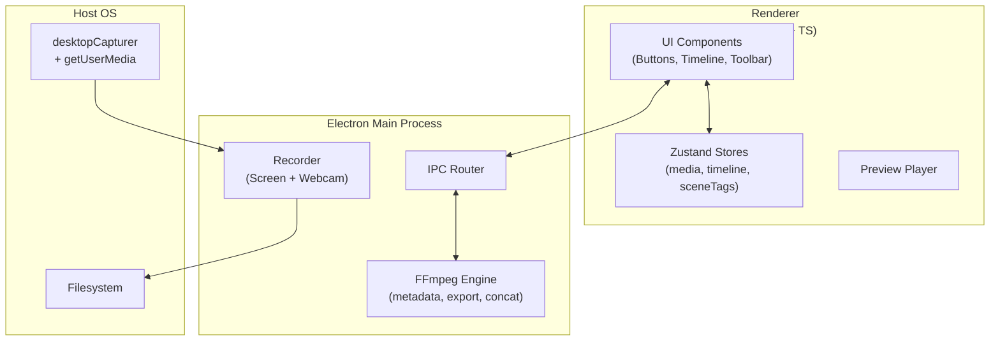

<p align="center">
  
</p>

<h1 align="center">🔥 ClipForge</h1>
<h3 align="center">Fast. Focused. Forged for Creators.</h3>

<p align="center">
  <strong>A modern, open-source desktop video editor built with Electron, React, and FFmpeg.</strong><br/>
  Designed for speed, creativity, and AI-augmented editing.
</p>

<p align="center">
  <a href="#-features">✨ Features</a> •
  <a href="#-architecture">🧩 Architecture</a> •
  <a href="#-installation">⚙️ Installation</a> •
  <a href="#-development">💻 Development</a> •
  <a href="#-contributing">🤝 Contributing</a> •
  <a href="#-license">📜 License</a>
</p>

---

## 🔥 Overview

**ClipForge** is a next-generation **desktop video editor** built by creators, for creators.  
It’s designed to **simplify media workflows** — record, trim, arrange, and export — while being developer-friendly, open-source, and AI-ready.

> _“Every frame forged, every edit refined — the forge never cools.”_

---

## ✨ Features

🎥 **Recording** — Capture your screen, webcam, and mic directly within the app.  
🪄 **Smart Editing (MVP+)** — An AI-powered “Cut Assistant” that tags scene changes automatically.  
🎞 **Drag-and-Drop Timeline** — Arrange, trim, and split clips with a fluid UI.  
⚡ **Fast Exports** — Harness FFmpeg for instant concatenation and MP4 encoding.  
🧱 **Component-Based UI** — Built with a custom React design system and theme tokens.  
🪐 **Cross-Platform** — Runs on macOS & Windows via Electron + Vite.  
🧠 **AI-Enhanced Development** — Coded in tandem with GPT-based assistance (Codex-style workflow).

---

## 🧩 Architecture



**Stack:**

- **Electron** — app shell & native integration
- **React + TypeScript** — renderer layer
- **FFmpeg** — media handling
- **Zustand** — lightweight state management
- **Tailwind-like theme tokens** — for color, motion, spacing

---

## 🎨 Design Language

| Token          | Example                           | Value            |
| -------------- | --------------------------------- | ---------------- |
| **Primary**    | Forge Orange                      | `#FF5E2B`        |
| **Secondary**  | Slate Gray                        | `#1E1E1E`        |
| **Accent**     | Electric Blue                     | `#3BA9FF`        |
| **Typography** | Orbitron / Inter / JetBrains Mono | System-optimized |
| **Aesthetic**  | Minimal, Geometric, High Contrast | Brand-consistent |

> See [`docs/UI_COMPONENT_LIBRARY.md`](./docs/UI_COMPONENT_LIBRARY.md) for full visual system and component code.

---

## ⚙️ Installation

### 🧰 Prerequisites

- [Node.js 18+](https://nodejs.org)
- [FFmpeg](https://ffmpeg.org/download.html)
- macOS or Windows

### 🧾 Setup

```bash
# Clone the repo
git clone https://github.com/yourusername/ClipForge.git
cd ClipForge

# Install dependencies
npm install

# Run in dev mode
npm run dev
```

---

## 💻 Development

**Scripts:**

```bash
npm run dev         # Start Electron + Vite
npm run build       # Build production bundle
npm run package:mac # Package DMG for macOS
npm run package:win # Package EXE for Windows
npm run lint        # Lint and type-check
```

**Directory Layout:**

```
ClipForge/
├─ src/
│  ├─ main/        # Electron main process
│  ├─ renderer/    # React renderer
│  ├─ shared/      # Common types and constants
│  └─ ui/          # Component library
├─ docs/           # PRD, design, and QA materials
└─ build/          # Packaging and assets
```

---

## 🧪 Testing

ClipForge uses **Vitest** and **React Testing Library** for UI validation, with **Cypress** planned for integration tests.

Run all tests:

```bash
npm test
```

> See [`docs/qa/MVP-TESTS.md`](./docs/qa/MVP-TESTS.md) for manual QA scenarios.

---

## 🧰 Contributing

Pull requests are welcome — whether it’s for new features, UI polish, or AI integration.

### PR Workflow

1. Fork & clone the repo
2. Create a branch `feature/<your-feature>`
3. Run `npm run dev` and implement your changes
4. Submit a PR with a clear title and linked roadmap section

### Developer Guidelines

- Code with **clarity, performance, and consistency**
- Follow **Conventional Commits** (`feat:`, `fix:`, `refactor:`)
- Use the provided **PR template** (`.github/pull_request_template.md`)
- Keep PRs small and atomic

---

## 🧠 Roadmap

- ✅ MVP: Record • Import • Timeline • Export
- 🚧 AI Cut Assistant (scene detection scaffold)
- 🔮 Future: Transitions, Filters, Effects, Audio Editing
- 🌐 Cloud sync & web client (ClipForge Studio)

> Full roadmap at [`docs/ROADMAP.md`](./docs/ROADMAP.md)

---

## 🤝 Acknowledgments

- Built with ❤️ by **Rasheed Lewis**
- Guided by **AI pair-programming principles**
- Powered by **Electron**, **React**, and **FFmpeg**

> “Software is the new studio — and every edit is a stroke of creation.”

---

## 📜 License

**MIT License** — Free for personal and commercial use.
Attribution appreciated but not required.

---

<p align="center">
  <br/>
  <em>ClipForge — Edit Fast. Forge Creative.</em>
</p>
